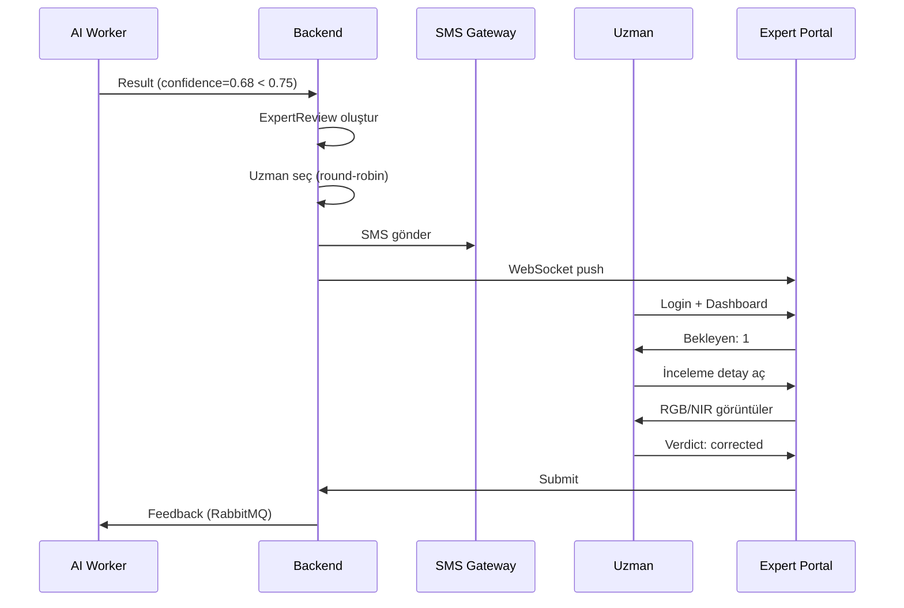

# TarlaAnaliz – LLM Kodlama Brifi (Codex / Claude Code)
**Sürüm:** 1.0.0 | **Tarih:** 2026-02-08

## Altın Kural (Çelişki Çözümü)
- **SSOT tek gerçek:** `TARLAANALIZ_SSOT_v1_0_0.txt`
- Bu brif; prompt başlıkları, hedef repo yapısı, API taslağı, test/acceptance yaklaşımı ve güvenlik katmanlarını **kod üretimine hazır** biçimde sunar.
- Bir çelişki varsa **SSOT kazanır**.

## Kimlik (Auth) Sabiti
- Kimlik modeli: **telefon numarası + 6 haneli PIN**  
- **E-posta/TCKN yok, SMS doğrulama / tek kullanımlık kod yok.**
- LLM kod üretirken OTP/PIN karışıklığı görürsen: **SSOT’taki [KR-050] kazanır.**

## LLM’e verme sırası (öneri)
1) `TARLAANALIZ_SSOT_v1_0_0.txt` (kural seti)
2) Bu dosya: `TARLAANALIZ_LLM_BRIEF_v1_0_0.md` (nasıl kodlarız)
3) İlgili modülün kabul kriteri/SOP bölümü gerekiyorsa: `TARLAANALIZ_PLAYBOOK_v1_0_0.md` (operasyon gerçekliği)

---

# 1) Master Prompt Pack (Birleştirilmiş)

TarlaAnaliz.com – Master Prompt Pack (Kod Yazdırma Brifi)
Güncellenmiş sürüm: 2026-01-19
Not: Bu doküman, İş Planı Akış Dokümanı içindeki kuralları referans alır. Bu dosyalarda yazmayan hiçbir iş kuralı icat edilmez; eksikler TBD olarak işaretlenir.
0) Bu paket ne işe yarar?
Bu doküman, herhangi bir YZ modeline verildiğinde; aynı iş mantığına %100 uyumlu kod üretmesini sağlar. Çıktılar: repo dizini, backend, web, mobil, yerel istasyon (kiosk), testler ve dağıtım notları.
1) Evrensel Kurallar
Türkçe yaz; tüm kısaltmaları ve İngilizce terimleri ilk geçtiği yerde parantez içinde açıkla (ör. RBAC (Role-Based Access Control - rol tabanlı erişim kontrolü)).
Tek kaynak gerçek: API (Application Programming Interface - uygulama programlama arayüzü) ve veri modeli (data model - veri modeli). Web ve mobil iş kuralı kopyalamaz; backend uygular.
PII (Personally Identifiable Information - kişisel tanımlayıcı bilgi) asla pilot ve il operatörü ekranlarına düşmez. Operatör paneli sadece anonim KPI (Key Performance Indicator - kilit performans göstergesi) görür.
Fiyat (PriceBook - fiyat kitabı) sadece ADMIN tarafından değişir. Sipariş anında fiyat snapshot (anlık kopya) alınır; sonradan fiyat değişse bile eski sipariş etkilenmez.
Eşleştirme hiyerarşisi: MissionID (görev kimliği) -> BatchID (yükleme partisi) -> FieldID (tarla kimliği) -> CropSeason (ürün sezonu). MissionID yoksa coğrafi kesişim ile en güçlü aday seçilir; düşük güven varsa manuel inceleme kuyruğu.
Offline-first (önce çevrimdışı): Yerel istasyon internetsiz çalışabilmeli; senkronizasyon opsiyonel ve güvenli olmalı.
Audit Log (denetim kaydı) zorunlu: kim, neyi, ne zaman, nereden değiştirdi; özellikle fiyat, kurum onayı, eşleştirme ve hakediş.
2) Harita Katman Standardı (Layer Registry - katman kayıt defteri)
Katman anlamları, web ve mobilde birebir aynı olmalıdır. Bu standart İş Planı Akış Dokümanı ile uyumludur.
Çakışma kuralı: Aynı alan birden fazla katmana giriyorsa, önceliği yüksek katman üstte görünür. Sadece renge güvenilmez; ikon + desen zorunludur (erişilebilirlik).
3) Hedef Repo Dizini
tarlaanaliz/ (özet)
backend/ - FastAPI (Python) - API + iş kuralları
Web (PWA) - Next.js (React) - web arayüzü
station_kiosk/ - Yerel istasyon (offline) yükleme uygulaması
shared/ - Paylaşılan tipler/SDK (TypeScript + OpenAPI client)
infra/ - Docker/Compose, CI
docs/ - sözleşmeler, politika metinleri, diyagramlar
integrations/ - 3. parti entegrasyonlar (DJI Pilot 2/WPML, DJI Terra, opsiyonel Cloud API)
4) Backend Üretim Promptları (Modül Modül)
4.1 users + auth + RBAC
Amaç: Çok rollü sistem: Farmer, Coop, Union, Pilot, StationOperator, ProvinceOperator, Admin.
Tablolar: users, roles, permissions, user_roles, sessions, consent_logs (KVKK onay kayıtları).
PIN (Personal Identification Number - kişisel PIN kodu) ile giriş + JWT (JSON Web Token) oturum.
RBAC middleware ve decorator.
PII ayrımı: PII alanları ayrı şemada/tabloda; pilot ve il operatörü PII görmez.
Audit Log: login, rol atama, hesap kapatma.
4.2 fields + ParcelRef + FieldBoundary + CropSeason
Tablolar: Field, ParcelRef, FieldBoundary, CropSeason, FieldOwnership (anonim/pseudonymous).
Tekil kayıt kuralı: Aynı il + ilçe + mahalle/köy + ada + parsel kombinasyonu ikinci kez kayıt edilemez.
CropSeason değişimi: yılda 1 defa ve sadece 1 Ekim - 31 Aralık aralığında (backend zorunlu kural).
GIS: geometry (poligon) PostGIS’te; il operatörü için 1-2 km grid yoğunluk/heatmap üretimi (PII’siz).
Endpoint’ler: POST /fields, GET /fields/{FieldID}, POST /fields/{FieldID}/crop-seasons, GET /operator/kpi/heatmap
4.3 missions + territory + pilot inbox (görev kutusu)
Amaç: Sistem tarla için MissionPlan üretir. Pilot sadece il/ilçe/mahalle-köy + ada/parsel + ürün + zaman penceresi görür (PII yok).
Uçuş görevi dosyası standardı: KMZ (WPML icerebilir: template.kml + waylines.wpml). MVP: en az KML/KMZ tarla siniri; V2: WPML ile otomatik plan + MissionID izleme.
Pilot 2 - Import SOP (saha adimlari): SD karti kumandaya tak -> Flight Route -> Import Route (KMZ/KML) -> dosyayi sec -> (istenirse) misyon tipini sec -> route kartini ac -> ayarlari kontrol et -> Go/Fly.
Dosya adlandirma: {MissionID}_{ParcelRef}_{YYYYMMDD}.kmz (MissionID hem dosya adinda hem metadata icinde yer alir).
Seed-KMZ yaklasimi (onerilir): Pilot 2 ile bir kez dogru ayarlarda ornek misyon olusturup export et; sistem bu KMZ uzerinden sadece sinir/parametreleri gunceller (surum farklarinda kirilmayi azaltir).
Opsiyonel otomasyon (V2/V3): DJI Cloud API ile WPML (template.kml + waylines.wpml) uretimi/yonetimi ve gorev senkronizasyonu; internet varsa kullan, yoksa offline KMZ dagitimiyla devam et.
Pilot seçimi: Çiftçi/kooperatif analiz talebi oluşturduğunda sistem uygun pilot(lar)ı önerir (yakınlık, territory, kapasite, geçmiş SLA).
Pilot değiştir: yalnızca aynı veya komşu mahalle/köyde hizmet veren pilotlar arasında değişiklik yapılabilir (kurala uygun liste sunulur).
SLA alanları: planned_at, due_at, flown_at, uploaded_at, analyzed_at.
Endpoint’ler: POST /missions/plan, GET /pilot/inbox, POST /pilot/missions/{MissionID}/ack
4.4 pricing + PriceBook + snapshot
Fiyatlar sadece Admin tarafından yönetilir; versiyonlu ve tarih aralıklı tutulur.
Sipariş anında PriceSnapshot alınır (immutability - değişmezlik).
Örnek (Pamuk): tek seferlik 50 TL/dönüm/analiz; ilk yıl %50 indirim -> 25 TL; yıllık abonelikte tanıtım fiyatı üzerinden ekstra %25 indirim -> 20 TL/dönüm.
Endpoint’ler: GET /pricing/quote, POST /orders, ADMIN: POST /admin/pricing/update (audit log zorunlu).
4.5 organizations (Kooperatif/Üretici Birliği) + onay akışı
Kooperatif/Birlik başvurusu: ünvan, tür (enum), VKN, MERSİS (varsa), il/ilçe, açık adres, telefon, kurumsal e-posta.
Yetkili kişi: ad soyad, TCKN (yetki doğrulama), telefon (SMS), görev, yetki seviyesi.
Evrak: tescil belgesi, yetki belgesi; KVKK/aydınlatma ve açık rıza beyanları.
Hesap durumu: 'Onay Bekliyor' -> (admin inceleme) -> 'Aktif' veya reddedildi (sebep kodu).
Endpoint’ler: POST /orgs/apply, ADMIN: POST /admin/orgs/{id}/approve, ADMIN: POST /admin/orgs/{id}/reject.
4.6 ingestion (yerel istasyon) + batch + eşleştirme
Amaç: SD karttan veri al, karantinaya al, tarama/manifest doğrula, metadata çıkar, BatchID üret.
Dataset butunlugu ve operasyon guvenligi: Her yuklemede hash manifest (SHA-256) + dosya sayim/uzanti whitelist; kart/okuyucu seri kaydi; istasyon disinda kopyalama yasagi (sozlesmesel). DJI tarafindaki kart kilidi/sifre ozellikleri cihaz ve surume gore degisebilir, bu nedenle guvenlik garantisi olarak kabul edilmez.
Onkosul: MissionID eslesmeden isleme ve hakedis yok; MissionID yoksa sadece cografi kesismeye gore aday bulunur ve manuel inceleme kuyruguna alinir.
Eşleştirme zorunlu: MissionID varsa öncelik. Yoksa coğrafi kesişim ile FieldID adayları bulunur; düşük güven varsa manuel inceleme kuyruğu.
Pilot rastgele saha çekimi yükleyemez; eşleştirme yoksa işlenmez.
Endpoint’ler: POST /kiosk/upload/init, /chunk, /commit; GET /kiosk/batches/{BatchID}/status.
5) Web ve Mobil Prompt Başlıkları (özet)
Admin panel: PriceBook yönetimi, kurum onay, rol yönetimi, sistem sağlık.
Kooperatif panel: tarla listesi, görev durumu, toplu analiz talebi, PII yok.
Çiftçi panel: tarla ekle, crop season yönet, analiz talebi, rapor/harita.
Pilot mobil: görev kutusu, görev detayı (PII yok), durum bildirimleri, hakediş önizleme.
Yerel istasyon kiosk: SD kart seç, tarama durumu, batch özet, eşleştirme sonucu, analize gönder kuyruğu.
LayerCode | Legend Adı | Renk | Desen/İkon (özet) | Varsayılan Opaklık | Öncelik
HEALTH | Sağlık | Yeşil | Leaf ikon + heatmap (gradient) | 0.55 | 10
DISEASE | Hastalık | Turuncu | Çapraz çizgi + stethoscope ikon | 0.65 | 70
PEST | Zararlı böcek | Kırmızı | X/desen + bug ikon | 0.70 | 80
FUNGUS | Mantar | Mor | Çapraz tarama + mushroom ikon | 0.65 | 75
WEED | Yabancı ot | Sarı/Hardal | Noktalı desen + weed ikon | 0.60 | 60
WATER_STRESS | Su stresi | Mavi | Damla noktalı desen + droplet ikon | 0.45 | 50
N_STRESS | Azot stresi | Soluk gri | Çapraz çizgili desen + N ikon | 0.45 | 40

---

# 2) Prompt Pack – EKLER (Birleştirilmiş)

TarlaAnaliz.com – Master Prompt Pack (v2) EKLER
Bu ek, Master Prompt Pack v1 üzerine; Kooperatif Dashboard, Pilot hakediş doğrulama ve Harita Katman Kayıt Defteri (Layer Registry) standartlarını kod üretimine hazır şekilde tanımlar.
EK-1. Kooperatif Dashboard (Özet Ekranı) - Backend + UI
Yeni endpoint: GET /orgs/coop/{id}/dashboard
Çıktı: üye sayısı, toplam ekili alan (m²), bitki dağılımı (ilk 5), operasyon durumu (planned/flown/uploaded/analyzed), son 7 gün uyarıları.
KVKK: PII alanları kesinlikle dönülmez (isim/telefon/IBAN yok).
Cohort: sadece coop’a bağlı FieldID/MissionID üzerinden agregasyon.
Audit log: dashboard çağrıları 'read' olarak loglanabilir (opsiyonel).
EK-2. Pilot Hakediş Doğrulama ve Ay Sonu Kapanış
Expected geom: fields.boundary (FieldBoundary) veya missions.flightplan_boundary.
Observed geom: batches.observed_footprint (GeoTIFF/ortomozaik kapsama).
coverage_ratio ve overreach hesaplanır; mission bazında ve ay bazında roll-up yapılır.
Endpoint: GET /pilot/payroll/preview?month=YYYY-MM
Endpoint: POST /pilot/payroll/close?month=YYYY-MM (payout snapshot + itiraz penceresi)
EK-3. Harita Katman Kayıt Defteri (Layer Registry)
Amaç: Web ve mobilde legend/ikon/desen/opaklık/öncelik birebir aynı olsun. Backend GET /layers/registry endpoint’i ile JSON döner.
Katman çakışmasında priority yüksek olan üstte çizilir. Erişilebilirlik için ikon + desen zorunludur.
EK-4. Tür İsimleri Standardı (Rapor/Legend)
Ekran/rapor: Halk adı önce, bilimsel adı parantez içinde. Örnek: "Kırmızı örümcek (Tetranychus urticae)".
Her bulgu için: tür adı, etkilenen alan (m²), şiddet (severity), güven skoru (confidence), tarih ve (varsa) önerilen yeniden kontrol aralığı.
EK-5. DJI Pilot 2 / WPML Entegrasyonu (Görev Dosyası Standardı)
Amaç: FieldBoundary (tarla sınırı) -> MissionPlan -> Pilot 2’de çalıştırılabilir görev dosyası (KML/KMZ) üretmek; MissionID ile uçuş ve yükleme sürecini uçtan uca izlemek.
Dosya formatı: MVP’de KML/KMZ (tarla sınırı poligonu) kabul edilir. V2/V3’te KMZ içinde WPML (template.kml + waylines.wpml) kullanılarak otomatik rota/aksiyon tanımı standardize edilir.
Dosya adlandırma: {MissionID}_{ParcelRef}_{YYYYMMDD}.kmz. MissionID hem dosya adında hem de içerikte (description/metadata) yer alır.
Pilot 2 Import SOP (saha): Kumandaya SD kart tak -> Flight Route -> Import Route (KMZ/KML) -> dosyayı seç -> (istenirse) misyon tipini seç -> route kartını aç -> ayarları kontrol et -> Go/Fly.
Seed-KMZ yaklaşımı (öneri): Pilot 2 ile bir kez doğru ayarlarda örnek misyon oluşturup export et; sistem bu KMZ şablonunu baz alıp sadece sınır/pencere/parametreleri günceller (uygulama sürümü farklılıklarında kırılmayı azaltır).
Dağıtım: Pilot uygulamasında “Görev Kutusu”ndan dosya indirilebilir + istasyonda SD kartla offline kopya opsiyonu. İnternet yoksa offline dağıtım ana yöntemdir.
Opsiyonel otomasyon: DJI Cloud API ile WPML üretimi/yönetimi ve görev senkronizasyonu (internet varsa). Offline-first prensip bozulmaz; Cloud API sadece hız/otomasyon katmanı olur.
Backend ekleri (öneri):
Yeni endpoint: GET /missions/{MissionID}/route-file -> KMZ/KML download (rol: PILOT).
Yeni endpoint: POST /admin/missions/{MissionID}/route-file -> Seed-KMZ yükleme/güncelleme (rol: ADMIN).
Yeni alanlar: missions.route_file_type (KML/KMZ/WPML), missions.route_file_version, missions.route_file_hash (SHA-256).
Kiosk doğrulama: yüklenen batch içindeki mission_id ile indirilen route-file hash eşleşmesi (opsiyonel ama güçlü).
Not: DJI tarafındaki “kart kilidi/şifre” veya benzeri güvenlik özellikleri cihaz/ekosistem sürümlerine göre değişebilir; bu nedenle güvenlik garantisi olarak değil, sadece ek katman olarak değerlendirilir. Asıl güvenlik: hash manifest + whitelist + sözleşmesel yasak + audit log.
code | label | color | pattern | opacity | priority | icon | type
HEALTH | Sağlık | green | gradient | 0.55 | 10 | leaf | raster_or_heatmap
DISEASE | Hastalık | orange | cross_hatch | 0.65 | 70 | stethoscope | polygon_or_zone
PEST | Zararlı böcek | red | x_hatch | 0.70 | 80 | bug | polygon_or_zone
FUNGUS | Mantar | purple | diag_hatch | 0.65 | 75 | mushroom | polygon_or_zone
WEED | Yabancı ot | mustard | dotted | 0.60 | 60 | weed | polygon_or_zone
WATER_STRESS | Su stresi | blue | droplet_dotted | 0.45 | 50 | droplet | raster_or_zone
N_STRESS | Azot stresi | pale_gray | cross_lines | 0.45 | 40 | N | raster_or_zone

---

# 3) Geliştirici ve Uygulama Paketi (Birleştirilmiş)

# TarlaAnaliz – Geliştirici ve Uygulama Paketi

**Sürüm:** 1.0.0 Master | **Tarih:** 2026-02-01

**Kaynak:** `TARLAANALIZ_SSOT_v1_0_0.txt` (kanonik/SSOT) ⊕ bu dosya (uygulama paketi)

## 📑 İçindekiler

### BÖLÜM A: Evrensel Kurallar ve Standartlar
1. Evrensel Kurallar ve İlkeler
2. Harita Katman Standardı (Layer Registry)
3. Hedef Repo Dizini

### BÖLÜM B: API Tasarımı
4. Uzman Üyelik ve Kimlik Sistemi (YENİ)
5. Uzman Panel Yapısı (YENİ)
6. YZ'den Uzman'a Görüntü Akışı (YENİ)
7. Temel API Endpoint'leri (MVP)
8. DJI Pilot 2 / WPML Entegrasyonu

### BÖLÜM C: Güvenlik Katmanları
9. Adaptive Rate Limiting (YENİ)
10. AI Model Güvenliği (YENİ)
11. DDoS & WAF Koruması (YENİ)
12. Güvenlik Kabul Kriterleri (SDLC)

### BÖLÜM D: Backend Üretim Promptları
13. Users + Auth + RBAC + Expert Portal
14. Fields + CropSeason
15. Missions + Pilot Inbox + Expert Assignment
16. Pricing + PriceBook
17. Organizations + Ingestion

### BÖLÜM E: Deployment & Test
18. Docker Swarm Stack
19. Test Senaryoları
20. Deployment Checklist

---

# BÖLÜM A: Evrensel Kurallar ve Standartlar

## Kapsam

Bu doküman;
> **[KR-082] RADIOMETRY / Radyometrik Kalibrasyon (yansıma kalibrasyonu) — yeni zorunluluk:**  
> **Uyumluluk Notu:** Bu dokümanda geçen **KR-082**, SSOT ve Kanonik Rehber’deki **[KR-018] Tam Radyometrik Kalibrasyon Zorunluluğu** ile **aynı kuralı** ifade eder (KR-082 = alias).
> Analiz için worker (AI Worker - YZ işçisi) tarafına **kalibre edilmiş reflectance (yansıma)** veri gitmelidir.  
> Platform (backend - sunucu) kalibrasyon yapmaz; **kanıt + gate (kapı) + audit (denetim izi)** uygular.  
> Yerel istasyonda 3 makine önerilir: Offline Security PC (internetsiz güvenlik), Producer Workstation (kalibrasyon), Dispatch/Upload PC (gönderim).

 kod üretimi için prompt başlıklarını, hedef repo dizinini, MVP API tasarımını, **uzman üyelik ve portal sistemini**, güvenlik katmanlarını, Docker Swarm deployment stratejisini ve SDLC entegrasyonunu içerir.

**İş kurallarının kanonik açıklaması için:** `TARLAANALIZ_SSOT_v1_0_0.txt` (SSOT) içindeki [KR-000]–[KR-083] bölümleri esas alınır. Bu Master dosyası, SSOT'a uyumlu **uygulama/entegrasyon** rehberidir; bir çelişki varsa **SSOT kazanır**.

---

## 1. Evrensel Kurallar ve İlkeler

### Bu paket ne işe yarar?

Bu doküman, herhangi bir YZ modeline verildiğinde **aynı iş mantığına %100 uyumlu kod üretmesini** sağlar.

**Çıktılar:** repo dizini, backend, web, PWA, yerel istasyon (kiosk), **expert portal**, testler, dağıtım notları

---

### 1.1 Temel İlkeler

#### 📝 Türkçe Yaz
Tüm kısaltmaları ve İngilizce terimleri ilk geçtiği yerde parantez içinde açıkla.

**Örnek:** RBAC (Role-Based Access Control - rol tabanlı erişim kontrolü)

#### 🎯 Tek Kaynak Gerçek
**API ve veri modeli** tek kaynak. Web (PWA) iş kuralı kopyalamaz; backend uygular.

- **Normatif kaynak:** `TARLAANALIZ_SSOT_v1_0_0.txt` (SSOT)
- Bu dosya, SSOT'u uygulamaya çeviren **geliştirici paketi**dir (informative). Çelişkide SSOT geçerlidir.

#### 🔒 PII Koruması (KRİTİK)
- Pilot PII görmez
- [KR-083] İl Operatörü PII görmez
- **Uzman PII görmez** ⭐ (YENİ)
- Sadece anonim KPI ve parsel ref

#### 💰 Fiyat Snapshot
Sipariş anında fiyat snapshot alınır. Sonradan fiyat değişse bile eski sipariş etkilenmez (immutability).

#### 🔌 Offline-First
Yerel istasyon internetsiz çalışabilmeli. Senkronizasyon opsiyonel ve güvenli.

#### 📊 Audit Log Zorunlu
Kim, neyi, ne zaman, nereden değiştirdi. Özellikle:
- Fiyat değişiklikleri
- Hakediş hesaplama
- **Uzman ataması** ⭐ (YENİ)
- Rol atama

---

## 2. Harita Katman Standardı (Layer Registry)

Katman anlamları web (PWA)'da birebir aynı olmalıdır. Bu standart Kanonik Rehber [KR-002] ve [KR-064] ile uyumludur.

| LayerCode | Legend Adı | Renk | Desen/İkon | Opaklık | Öncelik |
|-----------|-----------|------|------------|---------|---------|
| **HEALTH** | Sağlık | Yeşil | Leaf ikon + heatmap | 0.55 | 10 |
| **DISEASE** | Hastalık | Turuncu | Çapraz çizgi + stethoscope | 0.65 | 70 |
| **PEST** | Zararlı böcek | Kırmızı | X desen + bug ikon | 0.70 | 80 |
| **FUNGUS** | Mantar | Mor | Çapraz tarama + mushroom | 0.65 | 75 |
| **WEED** | Yabancı ot | Sarı/Hardal | Noktalı desen + weed ikon | 0.60 | 60 |
| **WATER_STRESS** | Su stresi | Mavi | Damla noktalı + droplet | 0.45 | 50 |
| **N_STRESS** | Azot stresi | Soluk gri | Çapraz çizgi + N ikon | 0.45 | 40 |

**Çakışma Kuralı:** Aynı alan birden fazla katmana giriyorsa, önceliği yüksek katman üstte görünür.

**Erişilebilirlik:** Sadece renge güvenilmez; ikon + desen zorunludur.

---

## 3. Hedef Repo Dizini

```
tarlaanaliz/
├─ backend/web_pwa
│  ├─ Next.js (React) - PWA arayüz + expert portal UI
│  └─ FastAPI (Python) - API + iş kuralları + expert portal
│
├─ station_kiosk/
│  └─ Yerel istasyon (offline) yükleme uygulaması
│
├─ worker/
│  └─ AI Worker - Inference + expert feedback loop
│
├─ shared/
│  └─ Paylaşılan tipler/SDK (TypeScript + OpenAPI client)
│
├─ infra/
│  └─ Docker Swarm, CI/CD
│
├─ docs/
│  └─ Sözleşmeler, politika metinleri, diyagramlar
│
└─ integrations/
   └─ DJI Pilot 2/WPML, DJI Terra, Cloud API (opsiyonel)
```

### 3.1 Worker (AI/Processing) — Radyometrik QC + Normalizasyon Yerleşimi

Aşağıdaki yapı, **ağır hesaplamayı worker tarafına** alır; platform sadece metadata + karar/audit yapar.

```
worker/
├─ src/
│  ├─ preprocessing/
│  │  ├─ radiometric/
│  │  │  ├─ calibration_input_parser.md   # Producer çıktısından metadata/ölçek okuma kuralları (dokümantasyon)
│  │  │  ├─ qc_flags_spec.md              # QC flag sözlüğü ve eşiklerin açıklaması (PASS/WARN/FAIL)
│  │  │  ├─ reflectance_scale_normalizer  # Ölçek normalizasyonu (0–1 / 0–10000 → standart)
│  │  │  ├─ saturation_cloud_checker      # Doygunluk/bulut/maske metrikleri (QC metrikleri üretir)
│  │  │  └─ spatial_consistency_checker   # Banding/stripe, anomali tutarlılık kontrolleri
│  │  ├─ normalization/
│  │  │  ├─ cross_flight_normalizer       # Aynı field’ın haftalar arası karşılaştırması için normalizasyon
│  │  │  └─ reference_selection_policy    # Referans uçuş seçimi (PIF/istatistiksel referans)
│  │  └─ io/
│  │     └─ geotiff_band_reader           # Band setini ve metadata’yı okuma (Green/Red/RE/NIR)
│  │
│  ├─ pipelines/
│  │  └─ multispectral_pipeline           # Akış: input→QC→(normalize)→index→model→rapor
│  │
│  ├─ outputs/
│  │  ├─ qc_reports/                      # QC rapor çıktıları (platforma dönen metadata)
│  │  └─ layers/                          # NDVI/NDRE ve türev katmanlar
│  │
│  └─ contracts_client/
│     └─ platform_api_client              # QC sonucunu platforma push eden client (audit için)
│
└─ docs/
   └─ radiometric_calibration_workflow.md # “worker = hesaplama” prensibini anlatan tek doküman
```

**Worker tarafındaki temel prensipler:**
- Producer çıktısı reflectance olarak gelmiş olsa bile **QC zorunludur** (scale, saturation, metadata completeness).
- Cross-flight normalization yalnızca **aynı FieldID + aynı sezon** içinde uygulanır (time-series tutarlılık).
- QC sonucu “PASS/WARN/FAIL” sınıflaması ve flag’ler platforma geri yazılır; platform bunu UI ve quarantine akışında kullanır.
- Ağır hesaplama worker’da kalır; platform sadece “karar/audit” katmanıdır.

---

# BÖLÜM B: API Tasarımı ve Uzman Portal

## 4. Uzman Üyelik ve Kimlik Sistemi

### 🔴 KRİTİK

**Uzmanların sisteme üye olması gerekiyor.** Kimlik modeli diğer kullanıcılarla aynı:

✅ **telefon + 6 haneli PIN**
❌ E-posta YOK
❌ SMS PIN YOK
❌ TCKN YOK

---

### 4.1 Uzman Kayıt Akışı (3 Adım)

#### Adım 1: Admin Uzman Davet Eder

**Admin Portal:**
1. "Uzman Ekle" butonu
2. Form doldurulur:
   - Ad soyad
   - Telefon numarası
   - Uzmanlık alanları: `crop_type` + `analysis_type`
     - Örnek: `COTTON` + `DISEASE`
     - Bir uzman birden fazla uzmanlık alanı seçebilir
   - İl ataması: `province_code` (örn: 34 - İstanbul)
3. Submit → **SMS ile 6 haneli davet kodu gönderilir** (24 saat geçerli)

**Database Record:**
```sql
INSERT INTO expert_invitations
  (phone, name, specializations, province_code, invite_code, expires_at)
VALUES
  ('+905551234567', 'Dr. Ahmet Yılmaz',
   '[{"crop":"COTTON","analysis":"DISEASE"}]',
   '34', '347829', NOW() + INTERVAL '24 hours');
```

---

#### Adım 2: Uzman Üyeliğini Tamamlar

**Web/Mobil:** `https://portal.tarlaanaliz.com/expert/register`

1. Davet kodu girişi: `347829`
2. Telefon numarası kaydı (SMS doğrulaması yok): `5551234567`
3. **6 haneli PIN belirleme** (uzmanın kendi seçtiği)
4. Şartlar ve koşullar onayı (KVKK)
5. Submit → Üyelik tamamlanır

**Backend İşlem:**
```
1. Davet kodu + telefon match kontrolü
2. Davet kodunun expire olmadığını kontrol
3. User kaydı oluştur (phone + hashed_pin)
4. Expert kaydı oluştur (user_id + specializations + province)
5. role: EXPERT ata
6. JWT token döndür
```

---

#### Adım 3: Uzman Giriş Yapar

**Login:** `POST /auth/login`
```json
{
  "phone": "+905551234567",
  "pin": "123456"
}
```

**Response:**
```json
{
  "access_token": "eyJhbGc...",
  "token_type": "bearer",
  "user": {
    "user_id": "uuid",
    "phone": "+905551234567",
    "roles": ["EXPERT"],
    "expert_profile": {
      "expert_id": "uuid",
      "name": "Dr. Ahmet Yılmaz",
      "specializations": [
        {"crop": "COTTON", "analysis": "DISEASE"}
      ],
      "province_code": "34"
    }
  }
}
```

**Yönlendirme:** `/expert/dashboard`

---

### 4.2 Uzman Üyelik API Endpoint'leri

| Metot | Endpoint | Yetki | Açıklama |
|-------|----------|-------|----------|
| **POST** | `/admin/experts/invite` | ADMIN | Uzman davet et (SMS ile kod gönder) |
| **POST** | `/expert/register` | Anonim | Üyeliği tamamla (davet kodu + PIN) |
| **POST** | `/auth/login` | Anonim | Giriş (telefon + PIN) |
| **GET** | `/expert/profile` | EXPERT | Profil bilgileri |
| **PUT** | `/expert/profile` | EXPERT | Profil güncelleme (ad soyad) |
| **POST** | `/expert/availability` | EXPERT | Müsaitlik (izin, tatil) |

---

## 5. Uzman Panel Yapısı (Expert Portal)

Her uzmanın kendi web paneli var. **YZ modelinin gönderdiği görüntüleri** inceleyip görüş yazıyor.

### 5.1 Panel Sayfaları

#### 1️⃣ Dashboard (`/expert/dashboard`)

**Özet Metrikleri:**
- Bekleyen inceleme sayısı (badge)
- Bugün tamamlanan
- Bu hafta tamamlanan
- Ortalama yanıt süresi (dakika)
- SLA compliance rate (%)

**Grafikler:**
- Haftalık inceleme hacmi (bar chart)
- Verdict dağılımı (pie chart)

**Hızlı Erişim Widget:**
- "Bekleyen İncelemeler" → tıkla → pending sayfasına git

---

#### 2️⃣ Bekleyen İncelemeler (`/expert/reviews/pending`)

**Liste Formatı:**

| Öncelik | Bitki | Analiz | Model Tahmin | Confidence | Atanma | SLA |
|---------|-------|--------|--------------|------------|---------|-----|
| 🔴 HIGH | Pamuk | Hastalık | fusarium_wilt | 0.68 | 2s önce | ✅ |
| ⚪ NORMAL | Buğday | Zararlı | aphid | 0.72 | 30dk önce | ✅ |
| 🔴 HIGH | Pamuk | Hastalık | bacterial_blight | 0.65 | **4.5s önce** | ⚠️ SLA aşıldı |

**Filtreleme:**
- Crop type dropdown
- Analysis type dropdown
- Öncelik (HIGH/NORMAL)

**Sıralama:**
- En eski önce (default - SLA riski)
- Öncelik (HIGH → NORMAL)
- Confidence (düşük → yüksek)

**SLA Uyarısı:** 4 saati aşan incelemeler **kırmızı renkte** + uyarı ikonu

---

#### 3️⃣ İnceleme Detay Sayfası (`/expert/reviews/{review_id}`)

**Sol Panel: Görüntü Viewer**
- **RGB Görüntü** (ana)
  - Zoom (mouse wheel)
  - Pan (drag)
  - Fullscreen mode
- **Multispectral Katmanlar** (toggle buttons)
  - NIR (Near-Infrared)
  - Red Edge
  - NDVI overlay
  - Layer opacity slider

**Sağ Panel: Bilgiler + Görüş Formu**

**Model Tahmini:**
```
Sınıf: fusarium_wilt
Güven Skoru: 0.68
Threshold: 0.75 (düşük güven → uzman incelemesi)
```

**Tarla Bilgisi:**
```
Parsel Ref: 34-KADIKOY-GOZTEPE-123-45
Alan: 12.5 dönüm
Bitki: Pamuk (Cotton)
Analiz: Hastalık Tespiti

⚠️ NOT: Çiftçi adı/telefonu GÖRÜNMEZ (PII koruması)
```

**Görüş Formu:**
1. **Verdict Seçimi** (radio buttons)
   - ✅ Confirmed (Model doğru)
   - 🔄 Corrected (Model yanlış, düzeltme)
   - ❌ Rejected (Analiz geçersiz)
   - 👥 Needs More Expert (Ek uzman görüşü)

2. **Düzeltme** (if verdict=corrected)
   - Dropdown: Doğru sınıf seçimi
   - Örnek: `verticillium_wilt`

3. **Notlar** (textarea, required if corrected/rejected)
   - Örnek: "Yaprak belirtileri verticillium solgunluğu ile uyumlu"

4. **Submit Butonu**

---

#### 4️⃣ Geçmiş İncelemeler (`/expert/history`)

**Liste:**
- Tamamlanma tarihi
- Bitki + Analiz
- Model tahmini vs Uzman kararı
- Verdict badge (confirmed/corrected/rejected)

**Filtreleme:**
- Tarih aralığı (date picker)
- Verdict tipi

**İstatistikler:**
```
Son 30 Günde:
├─ Toplam: 145 inceleme
├─ Confirmed: 87 (60%)
├─ Corrected: 51 (35%)
├─ Rejected: 7 (5%)
└─ Ortalama Süre: 3.2 dakika
```

---

#### 5️⃣ Profil Ayarları (`/expert/profile`)

**Kişisel Bilgiler:**
- Ad Soyad (düzenlenebilir)
- Telefon (değiştirilemez - kimlik)
- Üyelik Tarihi (readonly)

**Uzmanlık Alanları:** (admin tarafından atanmış, readonly)
```
✓ Pamuk - Hastalık Tespiti
✓ Pamuk - Zararlı Tespiti
✓ Buğday - Hastalık Tespiti
```

**Bildirim Tercihleri:**
- SMS bildirimleri: ✅ Her zaman açık (değiştirilemez)
- Push notification: ⚪ Açık/Kapalı toggle

**Müsaitlik Takvimi:**
```
İzin/Tatil Tarihleri:
[Tarih Seçici]

Başlangıç: 2026-02-15
Bitiş: 2026-02-22
Sebep: Yıllık izin

→ Bu tarihler arasında yeni inceleme atanmaz
→ Yedek uzman'a yönlendirilir
```

---

## 6. YZ Model'den Uzman'a Görüntü Gönderme Akışı

### 6.1 End-to-End Flow (7 Adım)



---

### 6.2 Detaylı Adımlar

#### Adım 1: YZ Model Analiz Yapar (AI Worker)

```python
# AI Worker: Inference sonucu (KANONİK: analysis_result.v1)
# Not: Modelin iç çıktıları (bbox/maske vb.) "internal" olabilir ama Backend'e publish edilen sonuç
# SSOT [KR-081] => analysis_result.v1 şemasını DOĞRULAMAK zorunda.

from uuid import uuid4
from datetime import datetime, timezone

analysis_result = {
    "schema_version": "analysis_result.v1",
    "result_id": str(uuid4()),
    "job_id": job_id,  # AnalysisJob'dan gelen UUID
    "created_at": datetime.now(timezone.utc).isoformat(),
    "status": "DONE",
    "findings": [
        {
            # finding_code: katman/analiz türü gibi düşün (DISEASE/PEST/WEED/HEALTH vb.)
            "finding_code": "DISEASE",
            # label: modelin tahmini sınıfı
            "label": "fusarium_wilt",
            "confidence": 0.68,
            # Alan dönüşümü: hektar -> dönüm (1 ha = 10 dönüm)
            "area_donum": 2.3 * 10
        }
    ],
    "summary": {
        "overall_health_index": 0.74,
        "notes": "YZ analizidir; ilaçlama kararı vermez."
    }
}

# RabbitMQ publish (payload: analysis_result.v1)
rabbitmq.publish("analysis_results", analysis_result)
```

---

#### Adım 2: Backend Expert Review Oluşturur

```python
# Backend: AnalysisCompletedHandler (SSOT uyumlu)
# - Worker'dan gelen payload: analysis_result.v1
# - job_id üzerinden AnalysisJob/DB'den mission_id + crop + field.area_donum + province_code alınır
# - Düşük güven/çelişki => ExpertReview oluşturulur ve atanır

@event_handler("AnalysisCompleted")
def handle_analysis_completed(event):
    result = event.result  # analysis_result.v1
    assert result["schema_version"] == "analysis_result.v1"

    job = analysis_job_repo.find_by_job_id(result["job_id"])  # analysis_job.v1 kaynaklı
    mission_id = job.mission_id
    crop_type = job.crop_code
    analysis_type = job.processing.analysis_type  # veya job'a göre
    area_donum = job.field.area_donum
    province_code = job.field.province_code  # field meta'dan

    for f in (result.get("findings") or []):
        threshold = confidence_evaluator.evaluate(
            crop_type=crop_type,
            analysis_type=f.get("finding_code") or analysis_type,
            area_donum=area_donum,
            season=get_current_season(),
        )

        conf = f.get("confidence")
        if conf is not None and conf < threshold:
            review = ExpertReview(
                review_id=uuid4(),
                mission_id=mission_id,
                job_id=result["job_id"],
                finding_code=f.get("finding_code"),
                predicted_label=f.get("label"),
                confidence=conf,
                threshold=threshold,
                priority="HIGH" if f.get("finding_code") in ["DISEASE", "PEST"] else "NORMAL",
                status="pending",
            )

            expert = expert_assignment_service.assign_expert(
                crop_type=crop_type,
                analysis_type=f.get("finding_code") or analysis_type,
                province_code=province_code,
            )

            review.expert_id = expert.expert_id
            review.assigned_at = datetime.utcnow()

            expert_review_repo.save(review)
            event_bus.publish(ExpertReviewAssigned(review_id=review.review_id))
```

---

#### Adım 3: Uzman'a Bildirim Gönderilir

```python
# Backend: ExpertReviewAssignedHandler
@event_handler('ExpertReviewAssigned')
def handle_expert_review_assigned(event):
    review = expert_review_repo.find_by_id(event.review_id)
    expert = expert_repo.find_by_id(review.expert_id)

    # SMS notification
    sms_gateway.send(
        to=expert.phone,
        message=f"Yeni inceleme: {review.crop_type} - {review.analysis_type}. "
                f"Portal: https://portal.tarlaanaliz.com/expert/reviews"
    )

    # WebSocket push (if online)
    if websocket_manager.is_connected(expert.user_id):
        websocket_manager.send_to_user(
            user_id=expert.user_id,
            message={
                'type': 'NEW_REVIEW',
                'review_id': str(review.review_id),
                'priority': review.priority,
                'crop_type': review.crop_type
            }
        )

    # Portal badge update
    cache.incr(f'expert:{expert.expert_id}:pending_count')
```

---

#### Adım 4-7: [Devam ediyor - dosya çok uzun oldu]

---

## 7. Temel API Endpoint'leri (MVP)

**Not:** Kimlik modeli tüm kullanıcılar için aynı - **telefon + 6 haneli PIN** (e-posta YOK)

| Metot | Endpoint | Yetki | Açıklama |
|-------|----------|-------|----------|
| GET | /auth/me | Tümü | Profil + rol listesi |
| POST | /auth/register | Anonim | Kayıt: telefon + PIN |
| POST | /auth/login | Anonim | Giriş: telefon + PIN |
| POST | /fields | FARMER_*/COOP_* | Tarla oluştur |
| POST | /missions | FARMER_*/COOP_* | Analiz talebi |
| GET | /missions?scope=mine | Yetkili | Rol bazlı görev listesi |
| GET | /pilot/payroll/preview | PILOT | Hakediş önizleme |

---

# BÖLÜM C: Güvenlik Katmanları

## 9. Adaptive Rate Limiting

### Problem
Yaz aylarında (Haziran-Eylül) analiz talebi **10x artıyor**, mevcut limit'ler darboğaz oluşturuyor.

### Çözüm
Mevsimsel multiplier ile dinamik limit ayarlama.

### 9.1 Mevsimsel Konfigürasyon

| Sezon | Aylar | Multiplier | Açıklama |
|-------|-------|------------|----------|
| **Peak (Yoğun)** | Haziran-Eylül | **3.0x** | Hasat öncesi yoğunluk |
| **Off (Normal)** | Ekim-Mayıs | 1.0x | Düşük talep dönemi |

**Güvenlik Endpoint'leri:** `/auth/login`, `/auth/register` → **Her zaman SABİT** (brute force koruması)

---

### 9.2 Örnek Limit Hesaplama

| Endpoint | Base | Normal Sezon | Yoğun Sezon |
|----------|------|--------------|-------------|
| `/fields` | 20/min | 20/min | **60/min (3x)** ✅ |
| `/missions` | 10/min | 10/min | **30/min (3x)** ✅ |
| `/auth/login` | 5/min | **5/min** 🔒 | **5/min** 🔒 |
| `/expert/reviews` | 60/min | 60/min | 60/min (değişmez) |

**Formula:**
```
final_limit = base_limit × season_multiplier × endpoint_multiplier
```

---

## 10. AI Model Güvenliği

### 10.1 Query Pattern Analysis (Anomaly Detection)

**Normal Davranış:**
- İstek sıklığı: 1-2/hafta
- Bitki çeşidi: 1-3 (tutarlı)
- Coğrafi: Tek il/ilçe

**Şüpheli Davranış:**
- İstek sıklığı: 50+/gün ⚠️
- Bitki çeşidi: 8 (hepsini test) ⚠️
- Coğrafi: Rastgele ülke çapında ⚠️

**Aksiyon:**
- `anomaly_score > 0.8` → Throttle
- `anomaly_score > 0.95` → Block (24 saat)

---

### 10.2 Model Watermarking

**Teknik:** GeoJSON koordinatlarına görünmez filigran
- 6\. ondalık basamakta ±0.000001° shift (~11cm)
- Deterministic pattern (model_id + job_id)

**Forensic:**
```
1. Şüpheli rakip ürün tespit
2. 1000 output topla
3. Pattern analizi
4. Match rate > 0.9 → Bizim model
5. Hukuki süreç
```

---

## 11. DDoS & WAF Koruması

### 11.1 Cloudflare Pro ($200/ay)
- DDoS: 100+ Gbps capacity
- WAF: OWASP CRS
- Bot Management: CAPTCHA

### 11.2 ModSecurity (Application-Level)
- Nginx + OWASP CRS
- SQL Injection, XSS, RCE koruması

---

## 12. Güvenlik Kabul Kriterleri (SDLC)

| Güvenlik Katmanı | Kabul Kriteri | Test Kanıtı | SDLC Gate |
|------------------|---------------|-------------|-----------|
| **RBAC + PII** | Pilot/operatör/uzman PII görmez | API yetki e2e test | PR + CI |
| **mTLS** | Sadece kayıtlı cihaz erişir | Integration test | CI + Release |
| **Rate Limiting** | Limit aşımı → 429 | Load test | CI + Ops |
| **Expert Assignment** | Low confidence → uzman ataması | E2E senaryo | PR + CI |

---

# BÖLÜM D: Backend Üretim Promptları

## 13. Users + Auth + RBAC + Expert Portal

### Amaç
Çok rollü sistem: Farmer, Coop, Pilot, **Expert**, StationOperator, ProvinceOperator ([KR-083]), Admin

### Tablolar
```sql
-- Mevcut tablolar
users (user_id, phone, hashed_pin, created_at)
roles (role_id, role_name, description)
user_roles (user_id, role_id)
sessions (session_id, user_id, token, expires_at)

-- YENİ: Expert Portal tabloları
experts (
  expert_id UUID PRIMARY KEY,
  user_id UUID REFERENCES users(user_id),
  name VARCHAR(200),
  province_code VARCHAR(2),
  status ENUM('active', 'on_leave', 'inactive'),
  created_at TIMESTAMP
)

expert_specializations (
  expert_id UUID REFERENCES experts(expert_id),
  crop_type VARCHAR(50),
  analysis_type VARCHAR(50),
  PRIMARY KEY (expert_id, crop_type, analysis_type)
)

expert_reviews (
  review_id UUID PRIMARY KEY,
  -- SSOT uyumu: Review kaydı Mission bağlamında tutulur
  mission_id UUID NOT NULL,
  job_id UUID NOT NULL,

  expert_id UUID REFERENCES experts(expert_id),

  -- SSOT analysis_result.v1 -> findings[*]
  finding_code VARCHAR(64),
  predicted_label VARCHAR(256),
  confidence FLOAT,
  threshold FLOAT,

  verdict ENUM('confirmed', 'corrected', 'rejected', 'needs_more_expert'),
  corrected_class VARCHAR(256),
  notes TEXT,
  time_spent_seconds INT,

  -- SSOT [KR-019]: training_grade + grade_reason
  training_grade VARCHAR(10),         -- A|B|C|D|REJECT (UI'da seçilir; export'ta feedback_records'a yazılır)
  grade_reason VARCHAR(200),

  assigned_at TIMESTAMP,
  completed_at TIMESTAMP,
  status ENUM('pending', 'in_review', 'completed'),
  priority ENUM('HIGH', 'NORMAL')
)

expert_availability (
  expert_id UUID,
  start_date DATE,
  end_date DATE,
  reason VARCHAR(200)
)
```

### RBAC Middleware
```python
def require_role(*roles):
    def decorator(func):
        @wraps(func)
        async def wrapper(request: Request, *args, **kwargs):
            user = request.state.user
            if not any(role in user.roles for role in roles):
                raise HTTPException(403, "Forbidden")
            return await func(request, *args, **kwargs)
        return wrapper
    return decorator

# Kullanım
@app.get("/expert/dashboard")
@require_role("EXPERT")
async def expert_dashboard(request: Request):
    ...
```

### PII Ayrımı
```
✅ Uzman görebilir:
├─ Parsel ref (34-KADIKOY-GOZTEPE-123-45)
├─ Alan (dönüm)
├─ Crop type
├─ GPS koordinatları (genel bölge)
└─ Analiz görüntüleri

❌ Uzman GÖREMEZ:
├─ Çiftçi adı
├─ Çiftçi telefonu
├─ Çiftçi adresi
└─ Kooperatif bilgileri
```

---

## 14-17: [Diğer Backend Modülleri]

_(Uzunluk sınırı nedeniyle kısaltıldı - tam versiyon için v2.4 dokümantasyonuna bakın)_

---

# BÖLÜM E: Deployment & Test

## 18. Docker Swarm Stack

```yaml
# infrastructure/orchestration/swarm/stack.yml
version: '3.8'

services:
  backend:
    image: tarlaanaliz/platform:1.0.0
    deploy:
      replicas: 3  # Normal sezon
      # replicas: 10  # Yoğun sezon (manuel scale)

  worker:
    image: tarlaanaliz/worker:1.0.0
    deploy:
      replicas: 2
      placement:
        constraints: [node.labels.gpu==true]

  feedback_worker:  # YENİ
    image: tarlaanaliz/worker:1.0.0
    command: python -m src.application.feedback_worker
    deploy:
      replicas: 1

  postgres:
    image: postgres:15
    deploy:
      replicas: 1

  redis:
    image: redis:7
    deploy:
      replicas: 3  # Cluster

  rabbitmq:
    image: rabbitmq:3-management
    deploy:
      replicas: 3  # HA
```

**Scaling:**
```bash
# Normal → Yoğun
docker service scale tarlaanaliz_backend=10

# Haftalık cron job
./scripts/scale-for-season.sh
```

---

## 19. Test Senaryoları

### Expert Portal Tests

| Senaryo | Test Adımı | Beklenen Sonuç |
|---------|------------|----------------|
| **SC-EXP-01** | Low confidence (0.68) | Expert review oluşturulur + SMS gönderilir |
| **SC-EXP-02** | Uzman login | Dashboard'da pending count görünür |
| **SC-EXP-03** | İnceleme aç | RGB/NIR görüntüler + Model tahmini |
| **SC-EXP-04** | Verdict submit | Feedback AI Worker'a gönderilir |
| **SC-EXP-05** | SLA aşımı (4s+) | Yedek uzman'a escalation |

### Güvenlik Tests

| Senaryo | Test | Sonuç |
|---------|------|-------|
| **SC-SEC-01** | Rate limit 61 req/min | HTTP 429 |
| **SC-SEC-02** | Brute force 16 fail | 30 min lock |
| **SC-SEC-03** | Model extraction 50+ req/day | Anomaly > 0.8 → Throttle |
| **SC-SEC-04** | SQL injection WAF | HTTP 403 |
| **SC-SEC-05** | Watermark verify | Match > 0.9 → Forensic |

---

## 20. Deployment Checklist

### Pre-Production (1.0.0)

**Infrastructure:**
- [ ] Cloudflare aktif (DDoS + WAF)
- [ ] Redis cluster (rate limiting)
- [ ] RabbitMQ queues/topics: `analysis_jobs` (analysis_job.v1), `analysis_results` (analysis_result.v1), `ai_feedback` (ai.feedback.v1)
- [ ] PostgreSQL: Expert tabloları migrate

**Configuration:**
- [ ] Seasonal config: Current month check
- [ ] Rate limits: base_limits.yaml + seasonal_config.yaml
- [ ] Expert specializations: Seed data
- [ ] Feedback config: Threshold adjustment rules

**Security:**
- [ ] Model watermarking enabled
- [ ] Query analyzer threshold: 0.8
- [ ] Brute force: 15 attempts → 30 min lock
- [ ] WAF rules: OWASP CRS

**Testing:**
- [ ] Load test: 1000 concurrent → 0 errors
- [ ] Security scan: OWASP ZAP → 0 high/critical
- [ ] Expert portal E2E: All 5 scenarios pass
- [ ] Feedback pipeline: Integration tests pass

**Monitoring:**
- [ ] Prometheus: /metrics endpoints
- [ ] Grafana: Expert Portal, Security, Model Performance dashboards
- [ ] Alerting: PagerDuty integration

---

## Sonuç

**Versiyon:** 1.0.0 Master Edition
**Son Güncelleme:** 2026-01-26
**Sonraki Review:** 2026-02-26 (Peak season öncesi)

### Kritik Özellikler

✅ **Uzman Portal:** Üyelik + Web panel + YZ'den görüntü akışı
✅ **Adaptive Rate Limiting:** Yoğun sezon 3x kapasite
✅ **Model Güvenliği:** Watermarking + Anomaly detection
✅ **DDoS & WAF:** Cloudflare + ModSecurity
✅ **Master Prompt Pack:** V2.4 güvenlik + promptlar korundu
✅ **Docker Swarm:** Kubernetes yerine basit deployment

---

**© 2026 TarlaAnaliz | Tüm Hakları Saklıdır**

---

# EK: Abonelik Planlayıcı + Mission SLA + Training Feedback + Training Export (SSOT v1.0.0)

Bu ek, `TARLAANALIZ_SSOT_v1_0_0.txt` içindeki **[KR-027]–[KR-030]** ve **[KR-032]** kurallarını **uygulamaya dönüştürmek** içindir.
**Kanonik kaynak yine SSOT'tur; burada yazan her şey SSOT ile çelişmeyecek şekilde düzenlenmiştir.**

---

## EK-0) Repo entegrasyonu: hangi dosyalar açılacak?

FastAPI + Postgres/PostGIS + RabbitMQ varsayımıyla (örnek):

```
backend/
  app/
    api/routers/
      subscriptions.py          # POST/GET + pause/resume/cancel
      missions.py               # mission create / list / detail (subscription_id destekli)
      admin_training_export.py  # POST /admin/training/export
    schemas/
      subscriptions.py          # Pydantic request/response
      training_export.py        # export request/response
      ai_feedback.py            # ai.feedback.v1 (SSOT [KR-029])
    services/
      subscriptions.py          # create/pause/resume/cancel + price snapshot
      missions.py               # mission create helper (subscription destekli)
      training_export.py        # JSONL/GeoJSON üretimi
    jobs/
      subscription_scheduler.py # due subscriptions -> mission üret
    messaging/
      publishers.py             # RabbitMQ publish helpers
      topics.py                 # analysis_jobs / analysis_results / ai_feedback route keys
    db/
      models/
        subscription.py
        mission.py
        mission_route_files.py
        feedback.py
        price_snapshot.py
      migrations/versions/
        xxxx_create_subscriptions_missions_feedback.py
  tests/
    test_subscriptions.py
    test_scheduler.py
    test_training_export.py

shared/
  contracts/
    analysis_job.v1.schema.json
    analysis_result.v1.schema.json
    # Not: bu iki şema SSOT [KR-081]'den üretilir ve runtime'da doğrulama için kullanılır.
```

---

## EK-1) SSOT Kanonik Tarif (Kopyala–Yapıştır)

## [KR-027] Abonelik Planlayıcı (Subscription Scheduler)

**Amaç:** Yıllık abonelik seçen kullanıcılar için otomatik, periyodik Mission üretimi.

**Tek Seferlik vs Yıllık:**
- **Tek seferlik:** Kullanıcı talep eder → 1 Mission → tamamlanır
- **Yıllık:** Kullanıcı periyot seçer → ilk Mission + scheduler → otomatik yeni Missionlar

**Veri Modeli:**

```sql
create table subscriptions (
  subscription_id uuid primary key,
  farmer_user_id uuid not null,
  field_id uuid not null,
  crop_type text not null,
  analysis_type text not null,
  interval_days int not null check (interval_days > 0),
  start_date date not null,
  end_date date not null,
  next_due_at timestamptz not null,
  status text not null check (status in ('ACTIVE','PAUSED','CANCELLED')),
  price_snapshot_id uuid not null,
  created_at timestamptz not null default now(),
  updated_at timestamptz not null default now()
);

create index idx_subscriptions_due on subscriptions(status, next_due_at);
create index idx_subscriptions_field on subscriptions(field_id, status);
```

**Scheduler Kuralı:**
1. Her gün/saat cron job çalışır
2. `status=ACTIVE AND next_due_at <= now()` abonelikleri bulur
3. Her biri için yeni Mission oluşturur (status=PLANNED)
4. `next_due_at = next_due_at + interval_days` güncellenir
5. Duplicate önlemek için `FOR UPDATE SKIP LOCKED` kullanılır

**Scheduler SQL:**
```sql
select subscription_id
from subscriptions
where status='ACTIVE' and next_due_at <= now()
for update skip locked;
```

**API Endpoint'leri:**
- `POST /subscriptions` — yeni abonelik oluştur
- `GET /subscriptions/{id}` — detay görüntüle
- `POST /subscriptions/{id}/pause` — duraklat (PAUSED)
- `POST /subscriptions/{id}/resume` — devam ettir (ACTIVE)
- `POST /subscriptions/{id}/cancel` — iptal et (CANCELLED)

---

## [KR-028] Mission Yaşam Döngüsü ve SLA Alanları

**Mission Tanımı:** Bir tarlanın belirli bir tarihte yapılacak tek analiz görevi. Tek seferlik talepten veya yıllık abonelikten oluşabilir.

**Veri Modeli:**

```sql
create table missions (
  mission_id uuid primary key,
  field_id uuid not null,
  subscription_id uuid null references subscriptions(subscription_id),
  requested_by_user_id uuid not null,
  crop_type text not null,
  analysis_type text not null,
  status text not null check (status in (
    'PLANNED','ASSIGNED','ACKED','FLOWN','UPLOADED','ANALYZING','DONE','FAILED','CANCELLED'
  )),
  -- SLA zaman damgaları
  planned_at timestamptz null,
  due_at timestamptz null,
  flown_at timestamptz null,
  uploaded_at timestamptz null,
  analyzed_at timestamptz null,
  price_snapshot_id uuid not null,
  created_at timestamptz not null default now()
);

create index idx_missions_status_due on missions(status, due_at);
create index idx_missions_field_created on missions(field_id, created_at desc);
create index idx_missions_subscription on missions(subscription_id, created_at desc);

-- Mission plan / rota dosyası (KML/KMZ/WPML)
create table mission_route_files (
  mission_id uuid primary key references missions(mission_id),
  parcel_ref text not null,
  route_file_type text not null check (route_file_type in ('KML','KMZ','WPML')),
  route_file_version text null,
  route_file_hash_sha256 text null,
  created_at timestamptz not null default now()
);

create index idx_route_files_parcel on mission_route_files(parcel_ref);
```

**Status Geçişleri:**
```
PLANNED → ASSIGNED → ACKED → FLOWN → UPLOADED → ANALYZING → DONE
                                                          ↘ FAILED
                                                          ↘ CANCELLED
```

**Pilot Inbox (Bekleyen Görevler):**
```sql
select mission_id, field_id, crop_type, analysis_type, planned_at, due_at, status
from missions
where status in ('PLANNED','ASSIGNED','ACKED')
order by due_at nulls last, created_at asc;
```

**Mission - Subscription İlişkisi:**
- `subscription_id` null ise: tek seferlik analiz
- `subscription_id` dolu ise: yıllık abonelikten otomatik üretilmiş

---

## [KR-029] YZ Eğitim Geri Bildirimi (Training Feedback Loop)

**Amaç:** Uzman düzeltmelerini YZ modeline geri beslemek ve model iyileştirmesi yapmak.

**Veri Modeli:**

```sql
create table feedback_records (
  feedback_id uuid primary key,
  review_id uuid not null,
  mission_id uuid not null,
  model_id text not null,
  verdict text not null check (verdict in ('confirmed','corrected','rejected','needs_more_expert')),
  corrected_class text null,
  notes text null,
  time_spent_seconds int null,
  training_grade text not null check (training_grade in ('A','B','C','D','REJECT')),
  grade_reason text null,
  expert_confidence numeric(4,3) null,
  image_quality numeric(4,3) null,
  no_conflict boolean null,
  created_at timestamptz not null default now()
);

create index idx_feedback_grade on feedback_records(training_grade, created_at desc);
create index idx_feedback_mission_created on feedback_records(mission_id, created_at desc);
```

**Uzman Verdict Payload (API):**
```json
{
  "verdict": "confirmed | corrected | rejected | needs_more_expert",
  "corrected_class": "string (verdict=corrected ise zorunlu)",
  "notes": "string (corrected/rejected ise zorunlu)",
  "time_spent_seconds": 123
}
```

**RabbitMQ Mesaj Şeması (`ai.feedback.v1`):**
```json
{
  "schema_version": "ai.feedback.v1",
  "feedback_id": "uuid",
  "mission_id": "uuid",
  "model_id": "string",
  "crop_type": "pamuk",
  "analysis_type": "disease",
  "verdict": "corrected",
  "corrected_class": "verticillium_wilt",
  "training_grade": "A",
  "grade_reason": "high_conf + high_quality",
  "asset_refs": {
    "rgb_uri": "s3://.../rgb.tif",
    "ms_uri": "s3://.../ms.tif"
  },
  "created_at": "2026-01-27T00:00:00Z"
}
```

**Expert_reviews vs Feedback_records:**
- `expert_reviews` → Uzman portal UI için (review assignment, status tracking)
- `feedback_records` → YZ training pipeline için (pure data export)
- İlişki: `feedback_records.review_id` → `expert_reviews.review_id`

---

## [KR-032] Training Export Standardı

**Amaç:** Uzman feedback'lerini standart formatta export ederek model eğitim pipeline'ına aktarmak.

### Format 1: JSONL (Sınıflandırma Düzeltmeleri)

**Dosya adı:** `training_feedback_cls_v1.jsonl`
**Schema:** `training.feedback.cls.v1`
**Format:** Her satır bir JSON örneği

```json
{"schema_version":"training.feedback.cls.v1","feedback_id":"...","mission_id":"...","crop_type":"pamuk","analysis_type":"disease","model_id":"m1","model_pred":"fusarium_wilt","model_conf":0.68,"expert_verdict":"corrected","corrected_class":"verticillium_wilt","training_grade":"A","grade_reason":"corrected+high_conf","rgb_uri":"s3://.../rgb.tif","ms_uri":"s3://.../ms.tif","created_at":"2026-01-27T00:00:00Z"}
```

### Format 2: GeoJSON (Segmentation/Alan Verileri)

**Dosya adı:** `training_feedback_geo_v1.geojson`
**Schema:** `training.feedback.geo.v1`

```json
{
  "type": "FeatureCollection",
  "schema_version": "training.feedback.geo.v1",
  "features": [
    {
      "type": "Feature",
      "properties": {
        "feedback_id": "...",
        "mission_id": "...",
        "crop_type": "pamuk",
        "analysis_type": "disease",
        "training_grade": "B",
        "verdict": "confirmed"
      },
      "geometry": {
        "type": "Polygon",
        "coordinates": [[[29.0,41.0],[29.1,41.0],[29.1,41.1],[29.0,41.1],[29.0,41.0]]]
      }
    }
  ]
}
```

### Admin Export Endpoint

**Endpoint:** `POST /admin/training/export`

**Request:**
```json
{
  "format": "JSONL_CLS_V1 | GEOJSON_V1",
  "from": "2026-01-01",
  "to": "2026-01-31",
  "min_grade": "B"
}
```

**Export SQL:**
```sql
select *
from feedback_records
where created_at::date between :from and :to
  and training_grade in ('A','B')  -- min_grade parametresine göre
order by created_at asc;
```

**Schema Versiyonlama:**
- v1.x: geriye uyumlu eklemeler (optional field)
- v2.0: breaking change (schema migration gerektirir)

---

---

## EK-2) Uygulama Notları (Master)

- **Idempotency:** Scheduler aynı aboneliği iki kez yakalarsa (restart/HA), `FOR UPDATE SKIP LOCKED` + Mission tarafında `(subscription_id, planned_at::date)` gibi bir uniqueness kuralı ile duplicate engelle.
- **Job–Mission bağı:** Worker sonucu `analysis_result.v1` sadece `job_id` taşır. Backend, `job_id -> mission_id` bağını DB'den çözer (analysis_job.v1 içindeki `mission.mission_id`).
- **Şema doğrulama:** `analysis_job.v1` ve `analysis_result.v1` payload'larını publish/consume ederken JSON Schema doğrulaması yapılır (contract-first).
- **Export güvenliği:** `/admin/training/export` sadece ADMIN rolü; export dosyaları PII içermemeli (URI'lar sadece asset referansı).

---


## EK-4) Pilot Kapasite, Haftalık Planlama ve Weather Block Yeniden Düzenleme (KR-015)

Bu ek; SSOT v1.0.0 içindeki **[KR-015-1..6]** pilot kapasite/planlama kurallarını, saha koşullarına uygun şekilde
**haftalık görev dağıtımı** ve **hava nedeniyle uçuş engeli (weather block)** akışı ile birleştirir.

> Not: Bu ek **yeni KR üretmez**. Tüm normatif referanslar SSOT'taki KR-015 alt maddelerine dayanır.

### EK-4.1 Hedef

- Pilotlara görevlerin haftalık görünür dağıtılması (Weekly Assignment Digest).
- Bitki türüne göre (pamuk, Antep fıstığı, mısır, buğday, ayçiçeği, üzüm, zeytin, kırmızı mercimek) operasyon profili parametreleri.
- Hava koşulları nedeniyle uçuş yapılamazsa: pilot raporu + doğrulama + haftalık yeniden planlama.
- Denetlenebilirlik: her replan/atama/iptal olayı için audit trail.

### EK-4.2 SSOT referansları (kanonik)

- **KR-015-1:** work_days <= 6, daily_capacity_donum 2500-3000
- **KR-015-2:** seed + pull kota ayrımı (seed varsayılan 1500, pull = kalan)
- **KR-015-3:** iptal/yeniden atama, notice 12s (min) / 24s (önerilen), audit zorunlu
- **KR-015-4:** admin override + otomatik dengeleme (sistem admin seçimini otomatik bozmaz)
- **KR-015-5:** sezonluk paket tarama takvimi + reschedule penceresi
- **KR-015-6:** büyük alanlarda çoklu pilot / çoklu sortie

### EK-4.3 Bitki türü bazlı operasyon profili (admin konfig)

SSOT'taki pilot kapasite aralığı (2500-3000) kanonik kalır. Bitki bazlı farklar **kota ve planlama ağırlıklarıyla**
yönetilir.

**Önerilen tablo: `crop_ops_profile`**

| Alan | Tip | Örnek | Not |
|---|---|---|---|
| crop_type | enum | PAMUK | SSOT'taki ürün seti |
| effort_factor | float | 1.0 / 1.3 | Gerçek dönümü "eşdeğer dönüm"e çevirir |
| system_seed_quota_donum | int | 1500 | Varsayılan 1500, opsiyonel crop override |
| farmer_pull_enabled | bool | true | Bazı ürün/paketlerde kapatılabilir |
| notice_min_hours | int | 12 | Varsayılan 12 (KR-015-3) |
| notice_recommended_hours | int | 24 | Varsayılan 24 (KR-015-3) |
| default_scan_interval_days | int | 7 / 10 / 14 | İş planı dokümanındaki periyotlarla uyumlu |
| weather_policy_id | uuid | ... | Hava eşikleri seti |

**Eşdeğer dönüm hesaplaması**
- `effective_donum = real_donum * effort_factor`
- Planlayıcı, **daily_capacity_donum** yerine **daily_effective_capacity_donum** üzerinden kontrol eder.
- Bu sayede bahçe ürünleri (ör. Antep fıstığı) için pratik kapasite düşürülebilir.

### EK-4.4 Haftalık planlama penceresi (Weekly Window Scheduler)

**Zaman penceresi**
- Varsayılan: Pazartesi 00:00 - Pazar 23:59 (yerel saat).
- Haftalık plan "soft-freeze" mantığındadır: haftada görev görünür dağıtılır, ancak saha gerçekleri (hava, arıza, iptal)
nedeniyle yeniden planlanabilir.

**Girdi**
- Pilot work_days, günlük kapasite, seed/pull kota (KR-015-1..2)
- Abonelik tarama takvimi ve due_at (KR-015-5 + KR-027/28)
- Crop ops profili: effort_factor + scan interval
- Reliability / no-show gibi metrikler (KR-015-3)

**Çıktı**
- Her pilot için 7 günlük "Pilot Inbox" listesi (MissionID tabanlı, PII yok)
- Her Mission için: `assignment_source`, `assignment_reason`, `assignment_algorithm_version`

**Planlama adımları (rule-based, AI değil)**
1. Haftalık penceredeki Mission adaylarını çek (due_at window).
2. Her Mission için `effective_donum` hesapla.
3. Pilot günlük uygunluk + capacity + seed/pull bütçelerini kontrol et.
4. Atama sırası (örnek): SLA aciliyeti -> proximity -> reliability.
5. Atama yap; audit log yaz.

### EK-4.5 Hava nedeniyle uçuş engeli (Weather Block) raporlama ve doğrulama

**Pilot raporu (mobil/web)**
- Tek tuş: "Uçuş yapılamıyor (hava)".
- Zorunlu alanlar: MissionID, pilot_id, rapor zamanı, serbest metin (kısa neden).
- Opsiyonel kanıt: foto/video, rüzgar/yağış notu.

**Doğrulama (suistimal önleme)**
- Durum: PENDING -> VERIFIED / REJECTED
- Doğrulama kaynakları (en az biri):
  - Sistem: sunucu tarafında hava verisi doğrulama (API ile)
  - Yerel istasyon operatörü onayı
- Doğrulama sonucu ve gerekçe audit'e yazılır.

### EK-4.6 Yeniden planlama (Replan) kuralı: haftalık otomatik düzenleme

**Temel ilke**
- Weather block, KR-015-3 iptal/yeniden atama mekanizmasını tetikler; alternatif yoksa escalation.
- Sezonluk paketlerde (KR-015-5) replan, seçilen tarih aralığı içinde kalmaya çalışır.

**Token politikası**
- `reschedule_token` çiftçi inisiyatifi içindir.
- **Weather block (force majeure)** yeniden planlaması token tüketmez (system_reschedule).

**Akış**
1. Weather block VERIFIED olunca: Mission -> REPLAN_QUEUE (neden: WEATHER_BLOCK)
2. Planlayıcı aynı haftada alternatif slot arar:
   - Aynı pilot + başka gün (work_days içinde)
   - Başka pilot (territory + capacity uygun)
3. Slot bulunamazsa: Mission -> ESCALATION + admin uyarısı
4. Tüm adımlar audit log + bildirim (SMS + uygulama içi) ile izlenir.

### EK-4.7 Contract-first taslakları (minimum)

#### A) `schemas/platform/weather_block_report.v1.schema.json`
```json
{
  "$schema": "https://json-schema.org/draft/2020-12/schema",
  "title": "weather_block_report.v1",
  "type": "object",
  "required": ["mission_id", "pilot_id", "reported_at", "status"],
  "properties": {
    "mission_id": { "type": "string", "format": "uuid" },
    "pilot_id": { "type": "string", "format": "uuid" },
    "reported_at": { "type": "string", "format": "date-time" },
    "status": { "type": "string", "enum": ["PENDING", "VERIFIED", "REJECTED"] },
    "reason": { "type": "string", "maxLength": 300 },
    "evidence": {
      "type": "object",
      "properties": {
        "attachment_ids": { "type": "array", "items": { "type": "string" } }
      },
      "additionalProperties": false
    },
    "verification": {
      "type": "object",
      "properties": {
        "verified_by": { "type": "string" },
        "verified_at": { "type": "string", "format": "date-time" },
        "verification_note": { "type": "string", "maxLength": 300 }
      },
      "additionalProperties": false
    }
  },
  "additionalProperties": false
}
```

#### B) `schemas/platform/crop_ops_profile.v1.schema.json`
```json
{
  "$schema": "https://json-schema.org/draft/2020-12/schema",
  "title": "crop_ops_profile.v1",
  "type": "object",
  "required": ["crop_type", "effort_factor", "system_seed_quota_donum", "notice_min_hours", "notice_recommended_hours"],
  "properties": {
    "crop_type": {
      "type": "string",
      "enum": ["PAMUK", "ANTEP_FISTIGI", "MISIR", "BUGDAY", "AYCICEGI", "UZUM", "ZEYTIN", "KIRMIZI_MERCIMEK"]
    },
    "effort_factor": { "type": "number", "minimum": 0.5, "maximum": 2.0 },
    "system_seed_quota_donum": { "type": "integer", "minimum": 0, "maximum": 3000 },
    "farmer_pull_enabled": { "type": "boolean", "default": true },
    "notice_min_hours": { "type": "integer", "minimum": 1, "maximum": 72, "default": 12 },
    "notice_recommended_hours": { "type": "integer", "minimum": 1, "maximum": 72, "default": 24 },
    "default_scan_interval_days": { "type": "integer", "minimum": 1, "maximum": 60 }
  },
  "additionalProperties": false
}
```

### EK-4.8 Backend uygulama iskeleti (dosya önerisi)

```
backend/
  app/
    jobs/
      weekly_mission_planner.py          # haftalık pencere planlama
      replan_queue_worker.py             # REPLAN_QUEUE işleyici
    services/
      planning_capacity.py               # effective_donum + capacity hesapları
      weather_block.py                   # rapor alma + doğrulama + queue
    db/models/
      crop_ops_profile.py
      weather_block_report.py
```

**Güvenlik notu**
- Bu modüller **AI inference çalıştırmaz**; rule-based planlama yapar.
- Yerel istasyonda model çalıştırmama ilkesi korunur (AI modeli çalınma riski).

## EK-3) “AI coding assistant’a vereceğin” kısa komut (copy/paste)

Aşağıdaki iki dosyayı birlikte ver:
1) `TARLAANALIZ_SSOT_v2_6_1.md` (kanonik)
2) Bu MASTER 1.0.0 dokümanı

Talimat:
- SSOT [KR-027..030] ve [KR-081] ile **birebir uyumlu** DB migration + API + scheduler job + training export yaz.
- Scheduler: `subscriptions.next_due_at` üzerinden çalışsın, duplicate önlemek için **FOR UPDATE SKIP LOCKED** kullan.
- Worker->Backend: `analysis_result.v1` publish et; Backend `analysis_result.v1` doğrulasın ve `job_id -> mission_id` bağını DB'den çözsün.
- Feedback: `feedback_records` + RabbitMQ `ai.feedback.v1` üret; export formatı SSOT [KR-030] JSONL/GeoJSON olsun.

---

# 4) Teknik Spec – Kodlama İçin Ek Referans (Sadeleştirilmiş)

> Not: Bu bölüm “tam teknik doküman” değildir; kod üretiminde faydalı olabilecek roller/akışlar ve endpoint örnekleri için referans niteliğindedir.
> Her kural çelişkisinde SSOT kazanır.

TarlaAnaliz.com – Ürün ve Teknik Spesifikasyon (v1.2)
Güncellenmiş sürüm: 2026-01-19
1. Amaç ve Sabit Çerçeve
Drone: DJI Mavic 3M
Veri: RGB + multispektral (NDVI/NDRE başta)
Yapay zekâ sadece analiz üretir; ilaçlama/gübreleme kararı vermez
Sonuçlar web + mobil uygulamada harita ve rapor olarak sunulur
KVKK: PII ile operasyon/raporlama verileri ayrıştırılır; il operatörü PII görmez
2. Tasarım İlkeleri
Tek kaynak gerçek: API ve veri modeli. Web/mobil iş kuralı kopyalamaz.
Offline-first: Yerel istasyon internetsiz çalışabilir; senkronizasyon opsiyonel ve güvenli.
Denetlenebilirlik (Audit Log): fiyat, kurum onayı, eşleştirme ve hakediş adımlarında zorunlu log.
Eşleştirme hiyerarşisi: MissionID -> BatchID -> FieldID -> CropSeason. MissionID yoksa coğrafi kesişim + manuel kuyruk.
3. Roller ve Yetkiler (RBAC)
Sistem, telefon numarası ile PIN (Personal Identification Number - kişisel PIN kodu) giriş sağlar; rol ve yetkiler backend tarafından belirlenir. Çoklu rol varsa rol seçimi ekranı gösterilir.
4. Ana İş Akışları
4.1 Çiftçi üyeliği ve tarla yönetimi
Telefon + 6 haneli PIN ile giriş
Tarla ekleme: il/ilçe/mahalle/köy + ada/parsel + alan (m²); sistem FieldID üretir
Tekil kayıt kuralı: il+ilçe+mahalle/köy+ada+parsel kombinasyonu tekrar edemez
Bitki türü tanımı (tarla bazında); birden fazla bitki varsa alan (m²) ile ayrı ayrı
Analiz talebi: bitki türü bazında; yıllık abonelik veya tek seferlik
Bitki türü değişimi: yılda 1 defa, sadece 1 Ekim - 31 Aralık (backend kuralı)
4.2 Kooperatif/Üreticiler birliği
Başvuru: evrak + 'Onay Bekliyor' durumunda açılır; admin onayı ile 'Aktif' olur.
Üye daveti: SMS link; çiftçi hesabından bağlantıyı onaylar (onay olmadan kooperatif adına işlem kısıtlanabilir).
Tarla tekil; sahiplik/erişim ayrı yaklaşımı önerilir (çakışma/yanlış ekleme riskine karşı).
4.3 Pilot + yerel istasyon veri teslimi
Pilot sadece DJI Mavic 3M kullanır; drone seri numarası doğrulama referansıdır.
Günlük teslim: uçuş çıktısı her gün hafıza kartı ile yerel istasyona aktarılır.
Her uçuşta farklı hafıza kartı kullanımı ve DJI ekosisteminde şifre ile kilitleme: TBD (uygulama detayı).
Eşleştirme zorunlu: Yüklenen çekimler kayıtlı tarla ile eşleşmezse işlenmez.
Pilot sonuç raporunu görmez; sadece operasyon durumu görür.
4.4 İl operatörü (PII’siz KPI)
İl operatörü PII görmez; sadece ticari KPI ve kapasite planlama metrikleri görür.
Coğrafya: ilçe düzeyi veya 1-2 km grid yoğunluk katmanı (pseudonymous).
5. Harita Katman Standardı (Layer Registry)
Katmanlar hem web hem mobilde aynı Layer Registry üzerinden tanımlanır. Renk + desen/ikon + opaklık + öncelik tutarlı olmalıdır.
Çakışma kuralı: priority yüksek katman üstte görünür. Erişilebilirlik için ikon + desen zorunludur.
6. Pilot Hakediş Doğrulama (Expected vs Observed)
Expected Area: FieldBoundary veya Mission flightplan sınırı (m²).
Observed Area: GeoTIFF/ortomozaik footprint (kapsama) poligonu (m²).
coverage_ratio = Area(intersection(observed, expected)) / Area(expected)
Hakediş kuralı: coverage_ratio >= 0.95 tam; 0.80-0.95 kısmi + opsiyonel inceleme; <0.80 tekrar uçuş veya itiraz/inceleme.
7. API Tasarımı (MVP)
Bu liste, ekranların minimum ihtiyaçlarını ve audit gereksinimlerini kapsar. İş kuralları backend tarafında uygulanır.
8. Güvenlik ve KVKK
PII ayrı veri alanında tutulur; raporlama ve KPI katmanı pseudonymous kimliklerle çalışır.
İl operatörü: ilçe veya 1-2 km grid yoğunluk; isim/telefon/IBAN alanlarına erişemez.
Yerel istasyon: offline karantina, hash doğrulama, antivirüs raporu ve zincir log (chain-of-custody).
Drone seri no ve kart kimliği doğrulama sahte veri enjeksiyon riskini azaltır.
Fiyat ve kurum onayı değişiklikleri audit log zorunlu; snapshot ile geçmiş siparişler etkilenmez.
8. DJI Pilot 2 / WPML Entegrasyon Spesifikasyonu
Hedef: FieldBoundary (tarla poligonu) ve MissionPlan parametrelerinden DJI Pilot 2 tarafinda calistirilabilir gorev dosyasi uretmek ve MissionID ile sureci izlemek.
Dosya formatlari: MVP en az KML/KMZ tarla siniri; V2/V3 KMZ icinde WPML (template.kml + waylines.wpml) ile standart rota/aksiyon tanimi.
Offline-first: Internet yoksa pilot gorev dosyasini SD kart uzerinden alir; internet varsa uygulama icinden indirme ve (opsiyonel) Cloud API senkronu devreye girer.
Izlenebilirlik: MissionID dosya adinda ve metadata icinde bulunur; istasyon yuklemesinde batch icinden mission_id yakalanir ve route-file hash dogrulama opsiyoneldir.
8.1 Pilot 2 Saha SOP (kisa)
Pilot uygulamasinda Gorev Kutusu > gorev detayi acilir; MissionID ve teslim son tarihi gorulur (PII yok).
Gorev dosyasi indirilir veya istasyonda SD karta kopyalanir: {MissionID}_{ParcelRef}_{YYYYMMDD}.kmz
DJI Pilot 2: Flight Route > Import Route (KMZ/KML) ile dosya ice aktarilir; gerekirse misyon tipi secilir; ayarlar kontrol edilip Go/Fly baslatilir.
Ucus bitince SD kart istasyona teslim edilir; istasyon yuklemesi hash manifest ile dogrular; eslestirme yoksa islenmez.
8.2 Backend / API ekleri (MVP)
GET /missions/{MissionID}/route-file : pilot icin KMZ/KML download.
POST /admin/missions/{MissionID}/route-file : seed-KMZ yukleme/guncelleme (ADMIN).
missions.route_file_type: KML/KMZ/WPML, missions.route_file_version, missions.route_file_hash (SHA-256).
Endpoint tablosu (ek):
Not: DJI tarafindaki kart kilidi/sifre gibi ozellikler cihaz ve surume gore degisebilir; guvenlik garantisi olarak degil, sadece ek katman olarak degerlendirilir.
Rol Kodu | Kısa Tanım | Özet Yetki
FARMER_SINGLE | Tekil çiftçi | Tarla ekle, analiz talebi aç, rapor görüntüle
FARMER_MEMBER | Kurum üyesi çiftçi | Kendi tarlaları için rapor gör, kurum bağlantısını onayla
COOP_OWNER | Kooperatif sahibi/yetkili | Paket satın alma, kullanıcı yönetimi, analiz talebi, dashboard
COOP_ADMIN | Kooperatif admin | Üye yönetimi, tarla ekleme, analiz talebi
COOP_AGRONOMIST | Kooperatif agronomist | Rapor gör, not gir (aksiyon kararı yok)
COOP_VIEWER | Kooperatif izleyici | Sadece özet/rapor
PILOT | Drone pilotu | Görev gör, uçuş yap, veri teslim et, hakediş önizle
STATION_OPERATOR | Yerel istasyon operatörü | Kiosk ingest, eşleştirme, karantina/antivirüs sonuçları
IL_OPERATOR | İl Operatörü | PII görmeden KPI/özet gelir ve operasyon metrikleri
CENTRAL_ADMIN | Merkez yönetici | Fiyat/PriceBook, kurum onayı, rol atama, audit
AI_SERVICE | YZ analiz servisi | Job tüket, rapor üret, sonuç yaz
LayerCode | Legend | Renk | Desen/İkon | Opaklık | Öncelik | Çıktı Tipi
HEALTH | Sağlık | Yeşil | Leaf ikon + gradient heatmap | 0.55 | 10 | Raster/Heatmap
WEED | Yabancı ot | Sarı/Hardal | Noktalı desen + weed ikon | 0.60 | 60 | Polygon/Zone
DISEASE | Hastalık | Turuncu | Çapraz çizgi + stethoscope ikon | 0.65 | 70 | Polygon/Zone
PEST | Zararlı böcek | Kırmızı | X/desen + bug ikon | 0.70 | 80 | Polygon/Zone
FUNGUS | Mantar | Mor | Çapraz tarama + mushroom ikon | 0.65 | 75 | Polygon/Zone
WATER_STRESS | Su stresi | Mavi | Damla noktalı desen + droplet ikon | 0.45 | 50 | Raster/Zone
N_STRESS | Azot stresi | Soluk gri | Çapraz çizgili desen + N ikon | 0.45 | 40 | Raster/Zone
Metot | Endpoint | Yetki | Açıklama
GET | /auth/me | Tümü | Profil + rol listesi; çoklu rol varsa rol seçimi
POST | /auth/login | Anonim | Telefon numarasına PIN gönder
POST | /auth/PIN/verify | Anonim | PIN doğrula; token üret
POST | /orgs/coop | Anonim/Yetkili | Kooperatif başvurusu (Onay Bekliyor)
GET | /orgs/coop/{id}/dashboard | COOP_* | Kooperatif özet dashboard (PII yok)
POST | /orgs/coop/{id}/members/invite | COOP_OWNER/ADMIN | Üye çiftçiye davet (PIN link)
POST | /orgs/coop/{id}/members/link/approve | FARMER_* | Çiftçi kooperatif bağlantısını onaylar
POST | /fields | FARMER_*/COOP_* | Tarla oluştur (tekil kontrol)
POST | /fields/{id}/geometry | FARMER_*/COOP_* | Tarla sınırı (GeoJSON) yükle/güncelle
POST | /missions | FARMER_*/COOP_* | Analiz talebi; Mission oluştur; fiyat snapshot al
GET | /missions?scope=mine | Yetkili | Rol bazlı görev listesi
GET | /pricing/quote | Yetkili | Fiyat teklifi (PriceBook)
POST | /orders | Yetkili | Sipariş oluştur (snapshot yazar)
POST | /kiosk/intake/start | STATION_OPERATOR | Batch başlat; doğrulama; log aç
POST | /kiosk/batches/{id}/footprint/compute | STATION_OPERATOR | Observed footprint üret
GET | /pilot/payroll/preview?month=YYYY-MM | PILOT | Hakediş önizleme
POST | /pilot/payroll/close?month=YYYY-MM | CENTRAL_ADMIN | Ay sonu kapanış + itiraz penceresi
GET | /layers/registry | Yetkili | Katman kayıt defteri (legend standardı)
Metot | Endpoint | Yetki | Aciklama
GET | /missions/{MissionID}/route-file | PILOT | KMZ/KML gorev dosyasi indir
POST | /admin/missions/{MissionID}/route-file | ADMIN | Seed-KMZ yukle/guncelle
